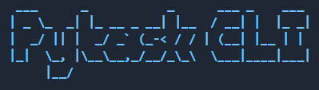
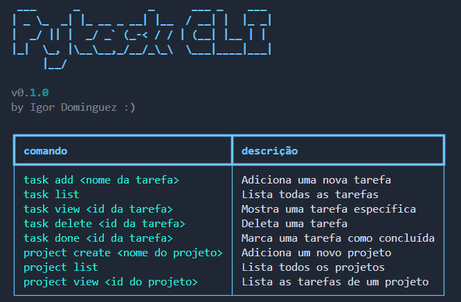

---

Pytask CLI é um gerenciador de tarefas para o terminal, feito com Python. Ele permite criar, listar, visualizar e gerenciar tarefas e projetos diretamente pelo terminal.

## Instalação

Clone o repositório:

```bash
git clone https://github.com/IgorDominguez/Pytask-CLI.git

cd Pytask-CLI
```

Crie e ative um ambiente virtual:

```bash
uv venv

.venv\Scripts\activate  # Windows

source .venv/bin/activate  # Linux/macOS
```

Instale as dependências e o CLI:

```bash
uv pip install -r requirements.txt

uv pip install -e .
```

Após a instalação, o comando `pytask` estará disponível globalmente no seu terminal.

## Primeiros Passos

Execute o comando abaixo para inicializar o CLI e ver a mensagem de boas-vindas:

```bash
pytask
```


## Comandos

### Tarefas

| Comando | Descricao |
|---|---|
| `pytask task add` | Adiciona uma nova tarefa |
| `pytask task list` | Lista todas as tarefas |
| `pytask task view <id>` | Mostra uma tarefa especifica |
| `pytask task delete <id>` | Deleta uma tarefa |
| `pytask task done <id>` | Marca uma tarefa como concluida |

### Projetos

| Comando | Descricao |
|---|---|
| `pytask project create` | Cria um novo projeto |
| `pytask project list` | Lista todos os projetos |
| `pytask project view <id>` | Lista as tarefas de um projeto |

## Exemplos de Uso

Adicionando uma tarefa:

```bash
pytask task add
```

```
Titulo da tarefa: Estudar para a prova
Descricao (opcional): Revisar os capitulos 1 ao 5
ID de um projeto para atribuir à um (opcional): 2

Tarefa "Estudar para a prova" adicionada com sucesso!
```

Listando todas as tarefas:

```bash
pytask task list
```

```
        Suas Tarefas
ID  Titulo                    Status
1   Estudar para a prova      pendente
2   Limpar a casa             concluida
```

Visualizando uma tarefa especifica:

```bash
pytask task view 1
```

Marcando uma tarefa como concluida:

```bash
pytask task done 1
```

Criando um projeto e adicionando uma tarefa a ele:

```bash
pytask project create
pytask task add  # informe o ID do projeto quando solicitado
```

Visualizando todas as tarefas de um projeto:

```bash
pytask project view 1 --tasks
```

## Tecnologias

- [Typer](https://typer.tiangolo.com/) - Framework para CLI
- [Rich](https://rich.readthedocs.io/) - Estilizacao do terminal
- [SQLAlchemy](https://www.sqlalchemy.org/) - ORM para banco de dados
- [Pyfiglet](https://github.com/pwaller/pyfiglet) - Titulo em ASCII art
